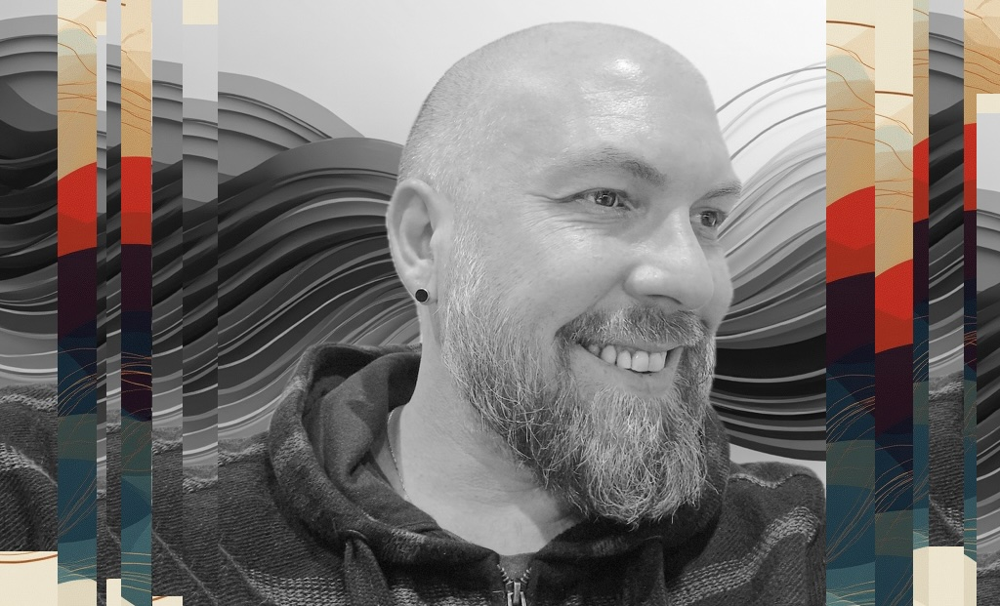

<link rel="stylesheet" href="style.css">

<link rel="icon" type="image/png" sizes="32x32" href="favicon-32x32.png">
<link rel="icon" type="image/png" sizes="16x16" href="favicon-16x16.png">
<link rel="apple-touch-icon" sizes="180x180" href="apple-touch-icon.png">
<link rel="manifest" href="site.webmanifest">
<link rel="shortcut icon" href="favicon.ico">

# R.D.C. Jazinski

**Researcher | Inquirer | Systems Thinker**

With a background in technology, media, computation, and epistemology, my work moves across disciplines to explore how form, [resonance](https://www.symbolicresonance.com), and [symbolic logic](https://www.symbolicresonance.com) shape the way we think, decide, and build.

Over the past 25 years, [I’ve worked in software development, systems architecture, strategic product design, interactive media, and leadership advisory](https://www.rodrigojazinski.com) — often navigating the space between engineering and intuition. In parallel, I’ve pursued a long-standing exploration of knowledge systems, symbolic structures, and the deeper harmonics that guide human cognition.

This ongoing research is not confined to a thesis or institution. It is a personal and recursive process of seeing the underlying shape of things — and learning how to hold complexity without collapsing it.

## Ongoing Research

This site serves as a long-term anchor for my independent research and future publications.

Throughout this inquiry, I’ve encountered books, papers, and works that have expanded and refined my thinking. Below is a small curated list — shared here without commentary.

* [Adi Shankara — *Crest Jewel of Discrimination*](https://amzn.to/4d4atol)
* [Alfred Korzybski — *Science and Sanity*](https://amzn.to/4mhbihQ)
* [Alfred North Whitehead — *Process and Reality*](https://amzn.to/431WTNI)
* [Carl G. Liungman — *Dictionary of Symbols*](https://amzn.to/3YyKsY9)
* [Charles Sanders Peirce (selected writings)](https://amzn.to/3RS5z46)
* [Claude Shannon — *A Mathematical Theory of Communication*](https://amzn.to/4iLv02h)
* [C.G. Jung — *Archetypes and the Collective Unconscious*](https://amzn.to/3EF0Wr9)
* [David Lewin — *Generalized Musical Intervals and Transformations*](https://amzn.to/43eKUxo)
* [Donna Haraway — *Staying with the Trouble*](https://amzn.to/3SkQ1FZ)
* [Douglas Hofstadter — *Gödel, Escher, Bach*](https://amzn.to/3YxjrEv)
* [Elaine Chew — *Mathematical and Computational Modeling of Tonality*](https://amzn.to/3GHyoOj)
* [Francisco Varela, Evan Thompson, Eleanor Rosch — *The Embodied Mind*](https://amzn.to/3ED90IY)
* [Gaston Bachelard — *The Poetics of Space*](https://amzn.to/4iUavQV)
* [George Spencer-Brown — *Laws of Form*](https://amzn.to/3GHE0rI)
* [Gregory Bateson — *Steps to an Ecology of Mind*](https://amzn.to/3EXxGvH)
* [Guerino Mazzola — *The Topos of Music*](https://amzn.to/433fjxo)
* [Henri Bergson — *Time and Free Will* or *Creative Evolution*](https://amzn.to/3Srfaig)
* [Hermann Weyl — *Symmetry*](https://amzn.to/4dagsbk)
* [Ibn Arabi — *The Bezels of Wisdom*](https://amzn.to/4ddHTkw)
* [Isabelle Stengers — *Thinking with Whitehead*](https://amzn.to/3RNvRED)
* [Jack Balkin — *The Laws of Change*](https://amzn.to/3GCfvMN)
* [J.C. Cooper — *An Illustrated Encyclopaedia of Traditional Symbols*](https://amzn.to/4iLxGNe)
* [Karen Barad — *Meeting the Universe Halfway*](https://amzn.to/3GT1UR2)
* [Kurt Gödel — *Collected Works*, Vol. I](https://amzn.to/3YyBGcN)
* [Ludwig von Bertalanffy — *General System Theory*](https://amzn.to/4jHD4lG)
* [Norbert Wiener — *Cybernetics: Or Control and Communication in the Animal and the Machine*](https://amzn.to/4k56mKY)
* [Paul Feyerabend — *Against Method*](https://amzn.to/4k0i4X3)
* [Richard Wilhelm (transl.) — *I Ching: Book of Changes*](https://amzn.to/3RR9NJ9)
* [Rudy Rucker — *Infinity and the Mind*](https://amzn.to/4jK74h1)
* [Thomas Kuhn — *The Structure of Scientific Revolutions*](https://amzn.to/4iMVf8c)
* [Umberto Eco — *A Theory of Semiotics*](https://amzn.to/4jORgcY)
* [W.A. Mathieu — *Harmonic Experience*](https://amzn.to/3GERZP4)
* [William A. Sethares — *Tuning, Timbre, Spectrum, Scale*](https://amzn.to/3Z5SEPM)

---

➡️ [rdcj-research.com](https://www.rdcj-research.com)  
➡️ [rodrigojazinski.com](https://www.rodrigojazinski.com)

Reach out: [reach@rdcjazinski.com](mailto:reach@rdcjazinski.com)

_© 2025 R.D.C. Jazinski. All rights reserved._

rdcjazinski.com participates in the Amazon Associates program, which means we may earn affiliate commissions when you buy products through our links. These commissions help support our independent research into symbolic systems, computation, and epistemology — at no extra cost to you.

